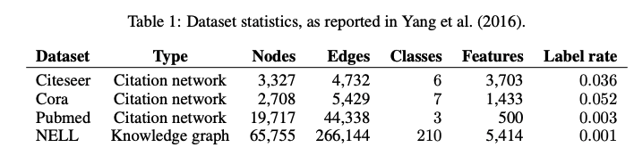

# GCN

# Graph Convolution Network for Pytorch


GCN implementation for paper: [Semi-Supervised Classification with Graph Convolutional Networks](https://arxiv.org/pdf/1609.02907.pdf)

### Referenced from these sources

- original pygcn only available for Cora [[link](https://github.com/tkipf/pygcn)]
- data processing for other datasets [[link](https://github.com/dragen1860/GCN-PyTorch)]
- preprocessing NELL dataset [[link](https://github.com/kimiyoung/planetoid)]

# Benchmark


## Task: Semi-supervised & Inductive learning




| Dataset | This repository (default seed 42) |
| --- | --- |
| citeseer | 0.7030 |
| cora | 0.8020 |
| pubmed | 0.7940 |
| nell | 0.58  |

Configurations for Nell

```
'dataset'       : 'nell.0.001',
'model'         : 'gcn',
'learning_rate' : 0.01,
'epochs'        : 200,
''hidden1'      : 64,
'dropout'       : 0.1,
'weight_decay'  : 1e-5,
```

Configurations for other datasets

```
'dataset'       : '',
'model'         : 'gcn',
'learning_rate' : 0.01,
'epochs'        : 200,
''hidden1'      : 16,
'dropout'       : 0.5,
'weight_decay'  : 5e-4,
```

# How to start


```python
pip install .
python3 train.py --dataset=nell.0.001 --hidden=64 --weight_decay=1e-5 --dropout=0.1
python3 train.py --dataset=cora
python3 train.py --dataset=pubmed
python3 train.py --dataset=citeseer
```